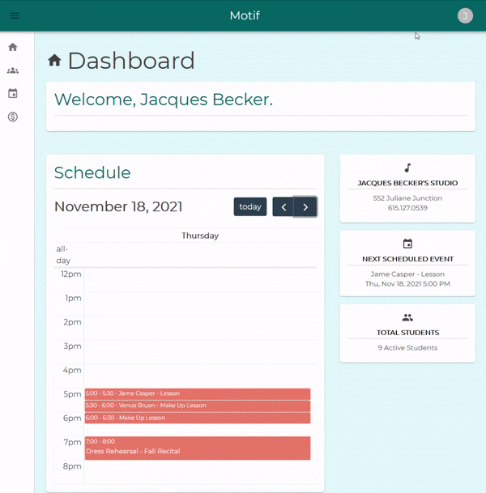

# Motif

__Motif__ is a studio management application for music teachers, students, and parents.

*This is the front-end repo of this project The back-end source code can be found [here](https://github.com/raquii/motif-api)*

## General Information

___

Motif uses a React front-end with a Ruby on Rails back-end with Postgres for the database management.

To see a demo of the application, see the [video walkthrough](https://youtu.be/0b08BDEyah8).

## Features

* Add students to studio with various enrollment levels, from active to wait-listed
* Create events from lessons, recitals, vacations, and student birthdays
* Fully responsive web application for use on any device
* Teachers can invite students and parents to become users with Devise-Invitable
* Role-based authorization keeps each user viewing only what they should
* Persistent app preferences, including event colors and default calendar views
* Add both recurrent and non-recurrent events with ease

### Room for Improvement

🔲 Invoicing/Billing abilities

🔲 Student/Parent front-end

🔲 Lesson Reminder Emails and SMS for students and parents

🔲 Refactor RTK logic to rely on built-in features of RTK Query auto-refetching

🔲 Recurrent date generation using rufus-scheduler

🔲 Password reset abilities

## How to Use

___

While the app has not been deployed for public use, you may fork and clone the repo to run on your local machine. You will need [Node](https://nodejs.org/en/) installed to run the front-end:

1. [Fork and clone](https://docs.github.com/en/get-started/quickstart/fork-a-repo) motif-app (this repo) onto your machine.
2. Run `cd motif-app`
3. Run `npm install`
4. Run `npm start`

The application should be available in your browser at `http://localhost:4000`

_In order to create an account and log-in, you will need to configure the back-end repository as well. **See below.**_

### Configure Back-end

You will need both [Ruby](https://www.ruby-lang.org/en/downloads/) and [Postgresql](https://www.postgresql.org/download/) to run the back-end

1. Fork and clone [motif-api](https://github.com/raquii/motif-api) onto your machine.
2. Run `cd motif-api`
3. Run `bundle install`
4. If needed, start the PostgreSQL server on your machine. *This varies by OS-- please search the internet for the proper command for your machine and Postgres install.*
5. Run `rails db:migrate` and `rails db:seed`
6. Run `rails s`

You may now log in as one of the example users in the seed file or create your own account from the client-side application.

## Resources

___

* Built with React.js using [CreateReactApp](https://create-react-app.dev/)
* [Redux Toolkit + RTK Query](https://redux-toolkit.js.org/)
* [FullCalendar](https://fullcalendar.io/)
* [Material-UI](https://mui.com/)
* [Draft.js](https://draftjs.org/)
* [React Router](https://github.com/remix-run/react-router)
